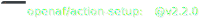

# action-setup

 [](https://github.com/OpenAF/action-setup/actions/workflows/tests.yml)

GitHub action to setup [OpenAF](https://docs.openaf.io).

Example:

```yaml
  - name: Setup OpenAF
    uses: openaf/action-setup@v1

  - name: Using OpenAF
    run : |
      echo Recursive list of files order by size:
      echo
      oafp data="." in=ls lsrecursive=true\
           sql="select filepath, permissions, size where isFile=TRUE order by size desc"\
           out=ctable
```

> Works together with https://github.com/OpenAF/ojob-action
